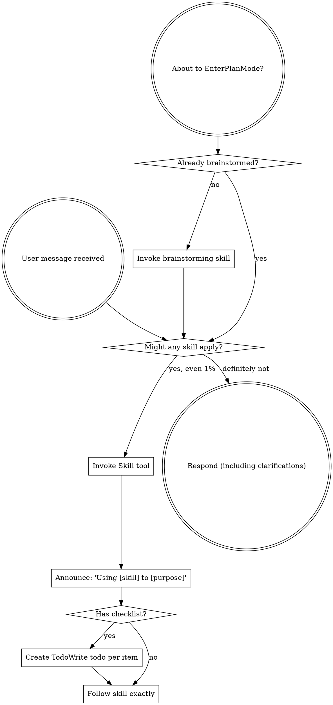

<EXTREMELY-IMPORTANT>
If you think there is even a 1% chance a skill might apply to what you are doing, you ABSOLUTELY MUST invoke the skill.

若某项技能适用于您的任务，您别无选择，必须使用它。

此事不容商议。此事没有选择余地。你无法用任何理由来逃避。
</EXTREMELY-IMPORTANT>

## 如何获取技能

**在 Claude 代码中：** 使用 Skill 工具。当您调用某项技能时，其内容将被加载并呈现给您——请直接遵循其指引。切勿对技能文件使用读取工具。

**在其他环境中：** 请查阅您平台的文档以了解技能加载方式。

# 使用技巧

## 规则

**在回应或行动前，先调用相关或所需的技能。** 即使某项技能只有 1% 的适用可能，也应尝试调用以作验证。若调用后发现该技能不适用于当前情境，则无需使用。

## 危险信号

这些想法意味着停止——你正在合理化：

| 思想 | 现实 |
| ---------------- | ------------------- |
| "这只是一个简单的问题" | 提问即任务。检验技能。 |
| "我需要先了解更多的背景信息。" | 技能检查应在澄清问题之前进行。 |
| "我先熟悉一下代码库" | 技能告诉你如何探索。先检查。 |
| "我可以快速检查 git/文件。" | 文件缺少对话上下文。请检查技能设置。 |
| "我先收集一下信息" | 技能告诉你如何收集信息。 |
| "这不需要什么专业技能" | 若有技能，便当善用。 |
| "我记得这个技能" | 技能不断演进。请阅读最新版本。 |
| "这不算任务" | 行动 = 任务。检查技能。 |
| 这项技能大材小用了。 | 化繁为简，善用其道。 |
| "我先把这个做完再说" | 行动前先检查。 |
| "这感觉很有成效" | 无章法的行动浪费时间。技能可避免此弊。 |
| "我明白那是什么意思。" | 知道概念 ≠ 掌握技能。付诸实践。 |

## 技能优先级

当多个技能适用时，请按以下顺序使用：

1. **流程技能优先** （头脑风暴，调试）——这些决定了如何着手任务
2. **实施技能其次** （前端设计，MCP 构建器）- 这些指导执行

"我们来构建 X" → 先头脑风暴，再落实执行技能。
"修复这个漏洞" → 先调试排错，再运用领域专长。

## 技能类型

**刚性** （测试驱动开发，调试）：严格遵循。切勿偏离规范。

**灵活的** （模式）：根据情境调整原则。

技能本身会告诉你答案。

## 用户指南

指令说明的是"做什么"，而非"如何做"。"添加 X"或"修复 Y"并不意味着可以跳过工作流程。
